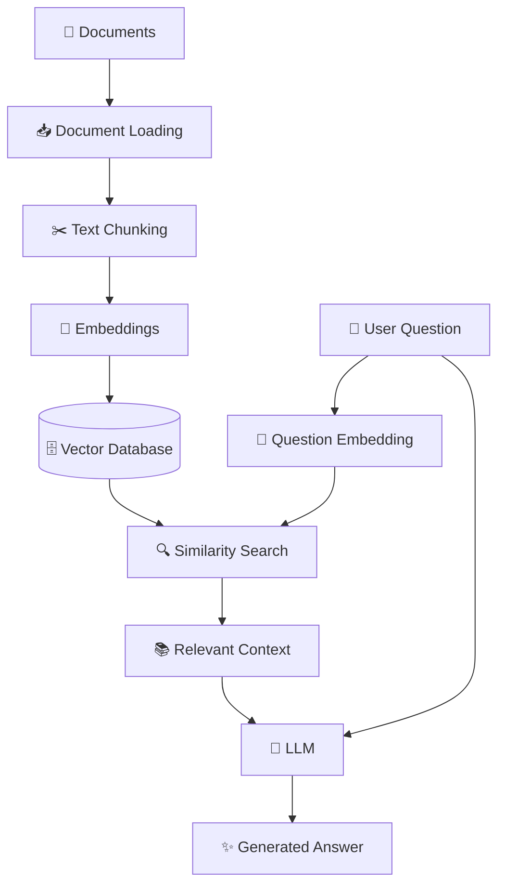
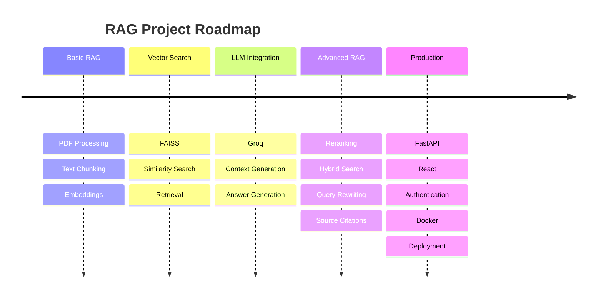

# 🤖 RAG — Retrieval-Augmented Generation

<p align="center">
  
  
  
  
</p>

<p align="center">
  <strong>An AI-powered Retrieval-Augmented Generation system for intelligent document question answering.</strong>
</p>

<p align="center">
  Ask questions about your documents and get context-aware answers powered by embeddings, vector search, and Large Language Models.
</p>

---

## ✨ Demo

<p align="center">

```text
╭──────────────────────────────────────────────╮
│              🤖 RAG ASSISTANT                │
├──────────────────────────────────────────────┤
│                                              │
│  📄 Documents                                │
│       ↓                                      │
│  ✂️  Text Chunking                            │
│       ↓                                      │
│  🧠 Embeddings                                │
│       ↓                                      │
│  🗄️  Vector Database                          │
│       ↓                                      │
│  🔍 Semantic Search                           │
│       ↓                                      │
│  📚 Relevant Context                          │
│       ↓                                      │
│  ⚡ LLM                                      │
│       ↓                                      │
│  💬 Intelligent Answer                       │
│                                              │
╰──────────────────────────────────────────────╯
```

</p>

---

## 📖 About the Project

**RAG (Retrieval-Augmented Generation)** is an AI technique that combines **information retrieval** with **Large Language Models (LLMs)**.

Instead of relying only on the knowledge stored inside an LLM, this project retrieves relevant information from your own documents and provides that context to the LLM before generating an answer.

### 💡 Example

**User asks:**

> What is the company's leave policy?

The RAG system:

```text
Question
   ↓
Convert question to embedding
   ↓
Search Vector Database
   ↓
Retrieve relevant document chunks
   ↓
Build context
   ↓
Send context + question to LLM
   ↓
Generate answer
```

This allows the AI to answer questions based on **your own documents**.

---

# 🚀 Features

| Feature                           | Description                                     |
| --------------------------------- | ----------------------------------------------- |
| 📄 **Document Processing**        | Load and process PDF documents                  |
| ✂️ **Text Chunking**              | Split large documents into manageable chunks    |
| 🧠 **Embeddings**                 | Convert text into numerical vectors             |
| 🗄️ **Vector Database**           | Store and search document embeddings            |
| 🔍 **Semantic Search**            | Find information based on meaning               |
| 📚 **Context Retrieval**          | Retrieve the most relevant document sections    |
| 🤖 **LLM Generation**             | Generate natural-language answers               |
| 💬 **Natural Language Questions** | Ask questions using normal language             |
| 📖 **Source Awareness**           | Connect answers with retrieved document context |

---

# 🏗️ RAG Architecture



---

# 🔄 How RAG Works

### 1️⃣ Document Loading

The system loads your documents:

```text
PDF
DOCX
TXT
Web Content
```

↓

### 2️⃣ Text Chunking

Large documents are divided into smaller pieces.

```text
Large Document
      ↓
 ┌────────────┐
 │ Chunk 1    │
 ├────────────┤
 │ Chunk 2    │
 ├────────────┤
 │ Chunk 3    │
 └────────────┘
```

↓

### 3️⃣ Embeddings

Each chunk is converted into a numerical vector.

```text
Text
 ↓
Embedding Model
 ↓
[0.21, -0.43, 0.72, ...]
```

↓

### 4️⃣ Vector Database

The vectors are stored for fast similarity searching.

```text
Document Chunk
      ↓
   Embedding
      ↓
Vector Database
```

↓

### 5️⃣ User Query

The user's question is also converted into an embedding.

↓

### 6️⃣ Similarity Search

The system finds the document chunks that are semantically closest to the question.

↓

### 7️⃣ Context + LLM

The retrieved information is provided to the LLM.

↓

### 8️⃣ Generated Answer

The LLM generates a context-aware response.

---

# 🛠️ Technology Stack

### Core

* 🐍 **Python**
* 🧠 **Sentence Transformers**
* 🔍 **FAISS**
* 📄 **PyPDF**
* 🔢 **NumPy**
* 📊 **Scikit-learn**
* 📈 **Matplotlib**

### LLM

* ⚡ **Groq**
* 🤖 Large Language Models

### Optional / Future

* 🔗 LangChain
* 🦙 LlamaIndex
* 🚀 FastAPI
* ⚛️ React
* 🐳 Docker
* 🗄️ PostgreSQL / Qdrant

---

# 📂 Project Structure

```text
RAG/
│
├── 📁 documents/
│   ├── sample.pdf
│   └── another-document.pdf
│
├── 🐍 main.py
├── 🐍 multipledoc.py
│
├── 🔐 .env
├── 🚫 .gitignore
├── 📦 requirements.txt
└── 📖 README.md
```

---

# ⚙️ Installation

## 1. Clone the Repository

```bash
git clone https://github.com/sumittiruwa/RAG.git
```

```bash
cd RAG
```

---

## 2. Create a Virtual Environment

### Windows

```bash
python -m venv venv
```

Activate it:

```bash
venv\Scripts\activate
```

### Linux / macOS

```bash
python3 -m venv venv
```

```bash
source venv/bin/activate
```

---

## 3. Install Dependencies

```bash
pip install -r requirements.txt
```

Or install the main dependencies:

```bash
pip install groq sentence-transformers faiss-cpu pypdf numpy matplotlib scikit-learn python-dotenv
```

---

# 🔐 Environment Variables

Create a `.env` file in the root directory:

```env
GROQ_API_KEY=your_groq_api_key
```

> ⚠️ **Never commit your `.env` file or API keys to GitHub.**

Your `.gitignore` should contain:

```text
.env
venv/
__pycache__/
```

---

# 📄 Add Your Documents

Create a `documents` folder:

```text
RAG/
└── documents/
    ├── python.pdf
    ├── ai.pdf
    └── machine-learning.pdf
```

The system will process the PDFs and create embeddings for their content.

---

# ▶️ Run the Project

For the basic RAG system:

```bash
python main.py
```

For the multiple-document RAG system:

```bash
python multipledoc.py
```

You should see:

```text
==============================
      ADVANCED RAG SYSTEM
==============================

Loading embedding model...

Embedding model loaded.

Reading: python.pdf
Reading: ai.pdf

Created 50 chunks.

FAISS index contains 50 vectors.

RAG system ready!

Type 'exit' to stop.

You:
```

---

# 💬 Example

### User

```text
What is machine learning?
```

### RAG Pipeline

```text
💬 Question
      ↓
🧠 Question Embedding
      ↓
🔍 Similarity Search
      ↓
📚 Relevant Chunks
      ↓
🤖 Groq LLM
      ↓
✨ Answer
```

### Output

```text
Assistant:

Machine learning is a branch of artificial intelligence
that enables computers to learn patterns from data and
make predictions or decisions without being explicitly
programmed for every task.
```

---

# 📊 Embedding Visualization

The project can also visualize high-dimensional document embeddings using **PCA**.

```text
             •       •
       •
                    •
   •          •
                         •
        •
  •
             •
```

Each point represents a document chunk in the embedding space.

This helps visualize how semantically similar documents are grouped together.

---

# 🧠 Core Concepts

This project demonstrates:

* 🤖 Large Language Models
* 🧠 Machine Learning
* 🔢 Embeddings
* 🗄️ Vector Databases
* 🔍 Semantic Search
* ✂️ Document Chunking
* 📚 Information Retrieval
* 💬 Prompt Engineering
* 🔗 RAG Pipelines
* 📄 Document Processing
* 📊 Embedding Visualization
* ⚡ AI Application Development

---

# 🎯 Learning Goals

By completing this project, you will understand how to:

```text
Documents
    ↓
Text Processing
    ↓
Embeddings
    ↓
Vector Search
    ↓
Information Retrieval
    ↓
Context Construction
    ↓
LLM
    ↓
AI Response
```

You will also understand the difference between:

**Traditional LLM**

```text
Question → LLM → Answer
```

and

**RAG**

```text
Question
   ↓
Retrieve Information
   ↓
Relevant Context
   ↓
LLM
   ↓
Answer
```

---

# 🔮 Future Improvements

* [ ] 📤 Add PDF upload
* [ ] 📚 Support multiple document formats
* [ ] 💬 Add chat history
* [ ] 📖 Add source citations
* [ ] 🔐 Add authentication
* [ ] 🚀 Build FastAPI backend
* [ ] ⚛️ Build React frontend
* [ ] 🔍 Add hybrid search
* [ ] 🧠 Add reranking
* [ ] 🔄 Add query rewriting
* [ ] 📊 Add RAG evaluation
* [ ] 🗄️ Add persistent vector database
* [ ] 🐳 Dockerize the application
* [ ] ☁️ Deploy the application

---

# 🗺️ Development Roadmap



---

# 🤝 Contributing

Contributions, suggestions, and improvements are welcome.

```bash
git checkout -b feature/new-feature
```

```bash
git add .
```

```bash
git commit -m "feat: add new feature"
```

```bash
git push origin feature/new-feature
```

Then open a Pull Request.

---

# ⚠️ Security

Never commit sensitive information such as:

```text
.env
API Keys
Passwords
Access Tokens
Database Credentials
```

Use environment variables instead.

---

# 👨‍💻 Author

<p align="center">

### **Sumit Tiruwa**

**AI/ML & Backend Developer**

Building applications with:

```text
Python • AI/ML • RAG • LLMs • Node.js • FastAPI • React
```

</p>

---

# ⭐ Support

If you find this project useful, consider giving the repository a ⭐ on GitHub.

<p align="center">

**Built with 🧠 Python + 🤖 RAG + ⚡ Groq**

</p>
